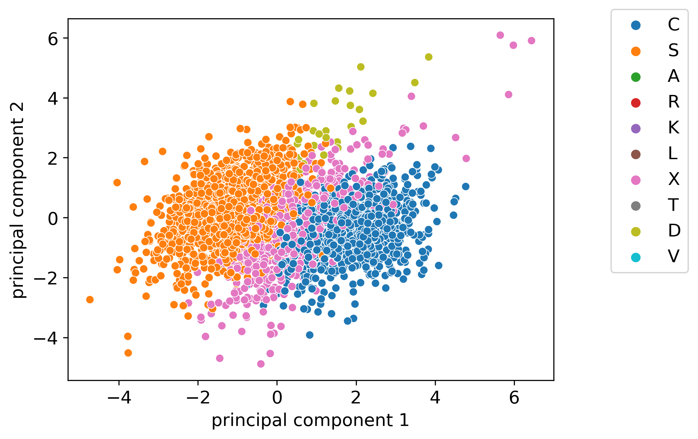
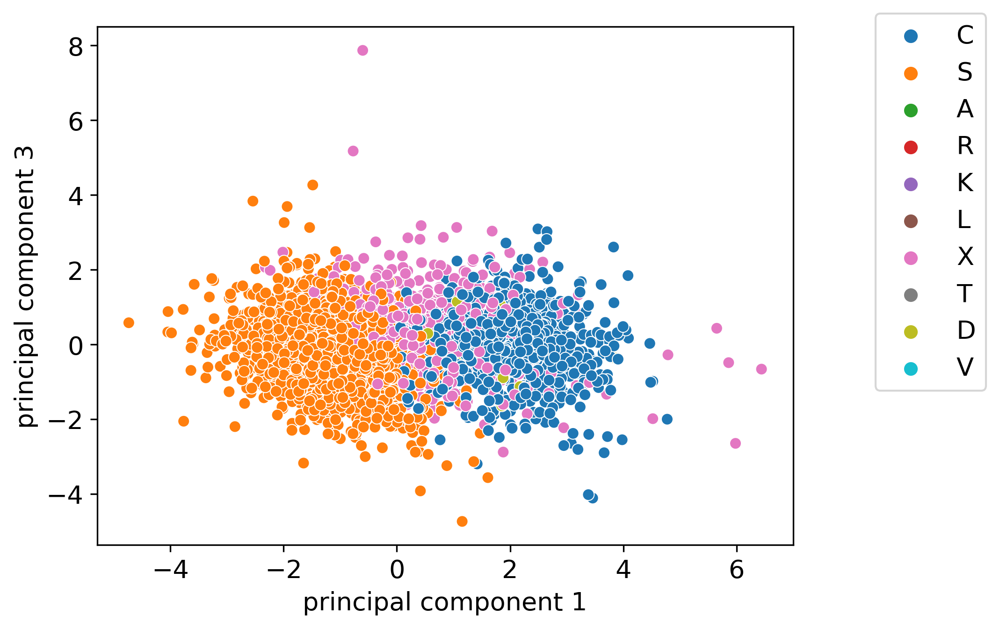
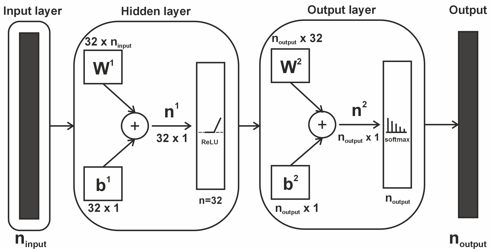

# Master-Thesis---Asteroid-classification
This is the Python code for my master's thesis on Asteroid Classification Using Gaia Spectroscopy and Photometry. The thesis with explained methodology can be viewed here: https://helda.helsinki.fi/items/5504be05-9691-4c63-a772-0e1cab9ddb91.

The code is presented as a jupyter notebook file and as a .py file. The data needed to run the code is not provided, since some of it is not yet published and thus not in public access.

 
*The 4,117 previously unlabeled asteroids plotted using their PCA components [Section 3.1 of the thesis](https://helda.helsinki.fi/items/5504be05-9691-4c63-a772-0e1cab9ddb91)  and colour-coded with predicted asteroid taxonomy labels.*

## Code Purpose

This Python code performs asteroid classification using spectral and photometric data from Gaia DR3. It is designed to load, preprocess, and classify asteroids into taxonomic groups using a feed-forward neural network.

### Data Used:
- **Photometric Slopes**: Provided by Karri Muinonen’s group (University of Helsinki) from Gaia DR3 lightcurve data (not publicly accessible).
- **Spectral Data**: Available from Gaia DR3 and can be accessed via the European Space Agency's website.
- **Taxonomy Data**: Sourced from NASA's EAR-A-5-DDR-TAXONOMY-V6.0, combined into unified asteroid classes by Antti Penttilä (University of Helsinki) (partly not publicly accessible).

### Workflow:
1. **Data Loading**: Loads spectral, photometric, and taxonomic data.
2. **Preprocessing**: Standardizes and prepares the data. More details about preprocessing can be found in [Chapter 3](https://helda.helsinki.fi/items/5504be05-9691-4c63-a772-0e1cab9ddb91) of the thesis.
3. **Data Aggregation & PCA**: Aggregates the data and applies Principal Component Analysis (PCA) to reduce dimensionality.
4. **Neural Network Setup**: Builds and trains a feed-forward neural network. The data is run through 14 different combinations, which are detailed in [Section 3.2 of the thesis](https://helda.helsinki.fi/items/5504be05-9691-4c63-a772-0e1cab9ddb91).
5. **Running the Neural Network**: Executes the neural network to classify asteroids. More about the network architecture can be found in [Section 3.2.2](https://helda.helsinki.fi/items/5504be05-9691-4c63-a772-0e1cab9ddb91) of the thesis.

## Requirements

To run this code, you will need the following Python libraries:
- `pandas`
- `numpy`
- `scikit-learn`
- `SciPy`
- `PyTorch`
- `matplotlib`
- `seaborn`
